# Deep Learning for image reconstruction from fMRI

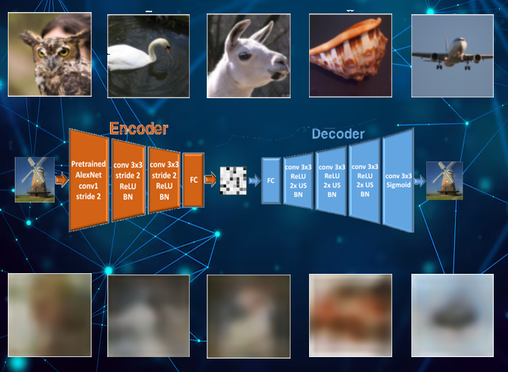

## Introduction

The human visual cortex encodes visual stimuli, and the brain's response to seen images can thus be analyzed thanks to fMRI. Deep learning methods to reconstruct those images from the corresponding neural activity is something that researchers have been trying to improve for several years now.

Recent methods implement complex and heavy architecture often including transformers and diffusion models to reconstruct images as faithful as possible to the original ones. 

For this project, I chose to implement a simpler architecture based on the method proposed by Beliy et al. in *From voxels to pixels and back* (2019). This method implements an encoder-decoder architecture relying on self-supervised learning to learn from small datasets.

The scarcity of labeled (image, fMRI) pairs, since acquiring paired data requires expensive scanner time, makes it challenging to train deep neural networks. Self-supervision, is implemented thanks to the encoder, allowing to exploit unlabeled data (images without fMRI, and test fMRI without images) to augment training and adapt the decoder to test-set statistics without additionnal acquisition cost.

## Objectives
- Implement a pipeline based on the Beliy et al. method:
    - retrieve the dataset
    - implement the Encoder-Decoder architecture
    - train on the dataset
- Evaluate results under different conditions
    - Compare results to Beliy et al.
    - Reduce the number of labeled data to measure changes on results quality and compare self-supervised to supervised-only methods
- Identify which regions of the visual cortex contributes most to reconstruction quality
    - select only a part of each fMRI data and measure changes in results


## Tools
- Python: all data processing, modeling and analysis

- Jupyter notebooks: reproducible pipelines with inline documentation

- Git, GitHub: Version control, sharing

- Google Colab: use GPU to train the models

- Additionnal tools: PyTorch (deep learning), h5py (HDF5 reading), scikit-image, HuggingFace Transformers, nilearn (ROI brain visualization), matpolib (results display)


## Dataset

**Generic Object Decoding** (Horikawa & Kamitani, 2017)

Provides the image-fMRI pairs needed for supervised training and for evaluation. Publicly available on figshare (article ID 7387130). The raw BIDS-formatted data is also available on OpenNeuro (ds001246).

Five subjects participated in fMRI sessions while viewing images drawn from ImageNet.
The stimulus set consists of 1250 ImageNet images. 1200 images were used as training stimuli (one presentation per image per subject) and 50 images were held out as test stimuli (35 repeated presentations per image per subject).

Voxel responses are expressed as z-scores computed per voxel per run and restricted to the visual cortex (4466 voxels for Subject1)

Anatomical ROI labels are provided for V1, V2, V3, V4, LOC, FFA, PPA, LVC, HVC and VC.

This project uses data from Subject1 only. The 1200 training trials provide supervised (image, fMRI) pairs for encoder and decoder training. The 50 averaged test fMRI are used as test set and as unlabeled fMRI data.

Stimuli images are not directly provided with the dataset but can be asked with the form: https://forms.gle/ujvA34948Xg49jdn9

## Deliverables

- `fmri_to_image_pipeline.ipynb` : Notebook with whole pipeline step by step
   - Step 1 : dataset downloading and creation of training and testing pairs
   - Step 2 : Encoder + Decoder implementation and training
   - Step 3 : Evaluation
- `Experiment_ROI.ipynb`: Notebook using the pipeline to train and compare models on different parts of the visual cortex
- `experiment_dataset_size.ipynb`: Notebook using the pipeline to train and compare supervised-only vs self-supervised methods on different dataset sizes


- Results: image reconstructions, metrics and comparison in the `results/` folder (how each results was obtained and by which model is decribed in the **Results** part of this report)

- The trained models are not direclty provided due to their size (>200 Mo) but explanation on how they were obtained is porvided

## Architecture and Methods

### Encoder E: image to fMRI prediction

```
Input: RGB image (3 x 112 x 112)
    AlexNet conv1 (ImageNet pretrained, frozen)
    BatchNorm2d(64)
    Conv3x3 stride=2, 32 channels, BN, ReLU  (x2)
    FC to fMRI prediction (4466,)
```

### Decoder D: fMRI to image reconstruction

```
Input: fMRI vector (4466,)
    FC, reshape (64 x 14 x 14)
    Conv3x3 + ReLU + Upsample×2 + BN  (x3)
    Conv3x3 + Sigmoid to RGB image (3 x 112 x 112)
```

### Training : Phase 1: Encoder (supervised)

SGD with momentum, CosineAnnealingLR, 80 epochs.

Loss: `L_r = α * MSE(E(img), fmri) − (1−α) * cosine(E(img), fmri)` with α=0.9

### Training : Phase 2: Decoder (self-supervised)

Adam, StepLR (x0.2 every 30 epochs), 120-150 epochs. Encoder frozen.

Three loss components:
- **L_D** (supervised): `image_loss(D(fmri), img)` on labeled pairs
- **L_ED** (unlabeled images): `image_loss(D(E(img_unlab)), img_unlab)` : forces D-E to be an identity on natural images
- **L_DE** (test fMRI without images): `fmri_loss(E(D(fmri_test)), fmri_test)` : adapts the decoder to test fMRI statistics

`total = lambda_d * L_D + lambda_ed * L_ED + lambda_de * L_DE`

lambdas coefficients can be adapted depending on the desired model

Image loss: `L1 + 0.1 * VGG19_features + 0.001 * TV`

### Evaluation metrics

- **PixCorr**: Pearson correlation between reconstruction and original pixels
- **SSIM**: Structural Similarity Index (scikit-image)
- **CLIP similarity**: cosine similarity between CLIP ViT-B/32 embeddings (captures high level features)
- **N-way identification accuracy**: for each reconstruction, identify the correct original image among n candidates by pixel correlation (n=2, 5, 10)

## Results

### Results folder structure

```
results/
    reconstructions/                All 50 test image reconstructions per model
    nway_accuracy/                  N-way identification accuracy plots
    snr_curves/                     Accuracy vs number of repetitions
    other_metrics/                  PixCorr, SSIM, CLIP similarity histograms
    roi_experiment/                 ROI comparison plots
    data_size_experiment/           Supervised vs self-supervised comparison
```
---
### Main pipeline
The results of three models trained on the main pipeline are available in the `results/` folder:
- `model_full_self_supervised`: (trained with lambda_d = 1, lambda_de = 1, lambda_ed = 1)
- `model_image_self_supervised`: (trained with lambda_d = 1, lambda_ed = 1, lambda_de = 0)
- `model_only_supervised`: (trained with lambda_d = 1, lambda_ed = 0, lambda_de = 0)

The following histrograms (available at `results/nway_accuracy/{model_name}_decoder_nway_accuracy.png`) show the 2-way, 5-way, 10-way accuracy of the three models compared to the results reported in the Beliy et al. paper and to chance.

<p float="left">
  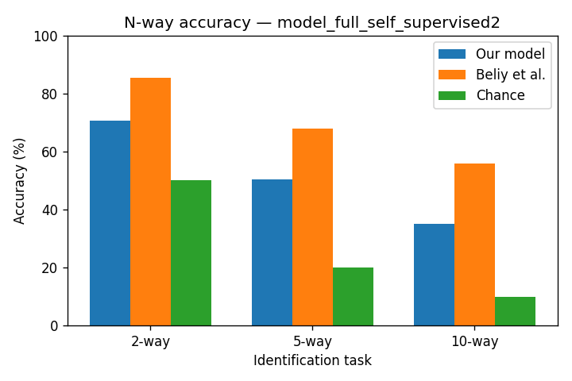
  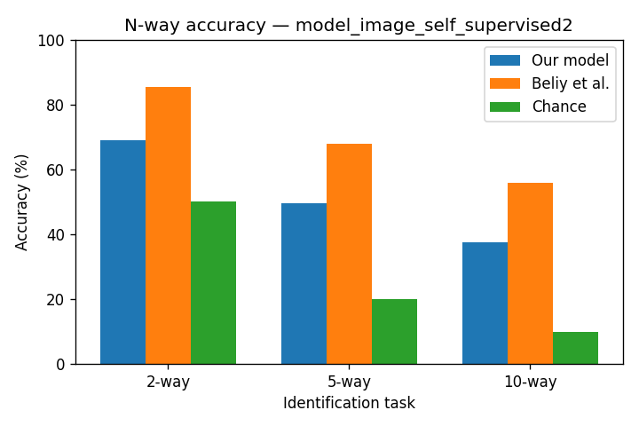
  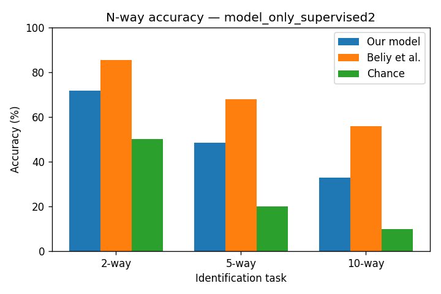
</p>

The obtained results are significantly above chance, which shows the ability of the architecture to reconstuct recognisable features, though it does not reach the Beliy et al. performances.

It is important to note that 2-way accuracy is quite variable accross trials for the same model (up to +- 3%)

Other metrics (SSIM, Pixel Correlation, CLIP similarity) were computed and can be found for each model under `results/other_metrics/metrics_{model_name}.png`

| Metric | full_self_supervised | image_self_supervised | only_supervised |
|--------|-------|--------------|--------|
| PixCorr | 0.271 | 0.270 | 0.265 |
| SSIM | 0.249 | 0.246 | 0.247 |
| CLIP similarity | 0.535 | 0.535 | 0.533 |
| 2-way accuracy | 70.6% | 74.5% | 71.7% |

Metrics are quite close for the three models though the only_supervised model seems to obtain a bit lower results, which would justify the use of self-supervision. More in-depth study is conducted in the dataset size experiment. 

---
#### Reconstructions:

All reconstruction for each trained model can be found under `results/reconstruction/{model_name}_decoder_all50.png`


Best reconstructions capture global color and shape though details are lost. However some reconstruction stray very far away from their ground truth (often due to lack of contrast or image complexity).

---
#### SNR analysis:

The fMRI signals for the test set are averaged across the 35 repetitions during acquisition, producing signals with a higher SNR. The following graph shows the evolution of reconstruction quality depending on the number of raw signals used for averaging:

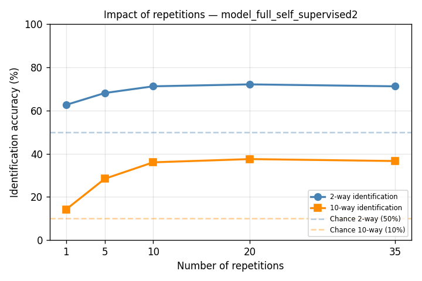

---
#### The Decoder-Encoder loss

During training, the L_DE loss does not decrease as expected, indicating that the model strugles to learn from the few fMRI signals.

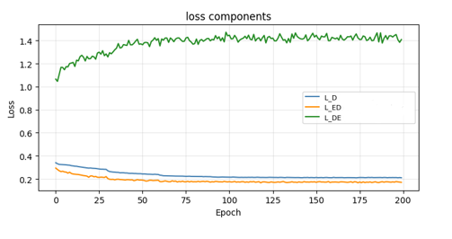

This is why, for all following models, the coefficients for self-supervised models are set to (lambda_d = 1, lambda_ed = 1, lambda_de = 0.05)

---

### ROI experiment : which brain regions carry reconstruction-relevant information?

This part focuses on the experiment conducted in the `Experiment_ROI.ipynb` notebook. The structure of the main pipeline is applied to train region specific models. Each model is trained on a reduced subsets of voxels corresponding to different parts of the visual cortex.

Labels for each voxel are provided, which anables to construct the following masks (dark parts correspond to the removed voxels):

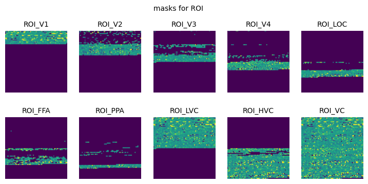

Corresponding parts of the brain (figure obtained with nilearn):

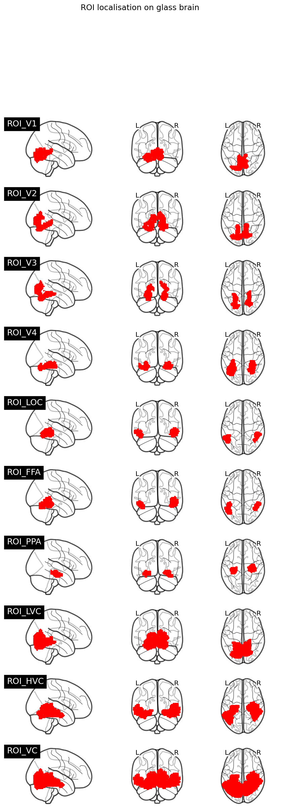

---
#### Reconstructions :
Reconstructions obtained for each part of the visual cortex can be found under the name `results/reconstructions/reconstructions_ROI_{roi_name}.png`

---
#### Performances :

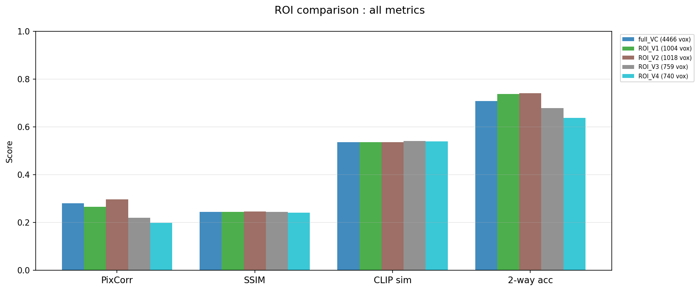
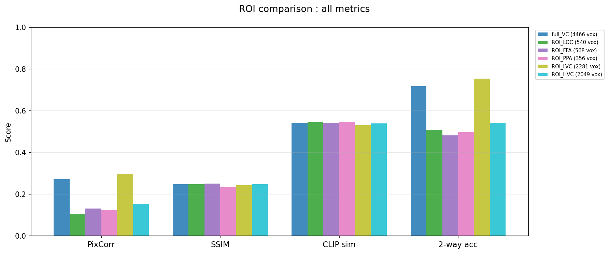

Observations:
Regions dedicated to low level features tend to perform better than those dedicated to higher ones.
 V1 (1004 voxels, 2-way=74%) and V2 (1018 voxels, 74%) match or exceed the full visual cortex (4466 voxels, 71%). This suggests that the low-level areas carry sufficient information for this reconstruction approach, and that adding higher-level areas does not help (possibly because the additional voxels introduce noise that is hard to handle with only 1200 training pairs).


#### Low visual cortex vs high visual cortex:

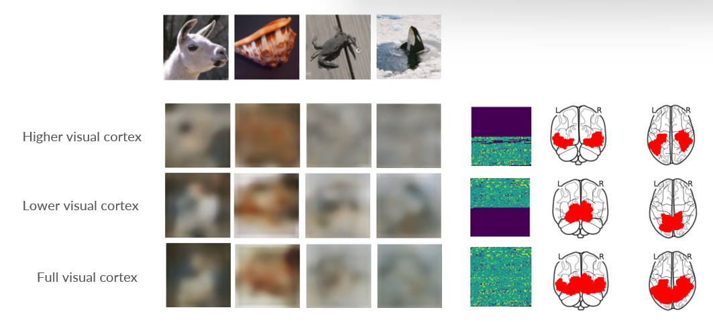

Images reconstructed from HVC tend to show less precise features and shapes, only global color. On the other hand, images reconstructed from LVC are sometimes even more precise than with the full visual cortex, showing more details and better defined objects.

---
### Dataset size experiment: how much does self-supervision help when data becomes even scarcer ?

This experiment is conducted in **dataset_size_experiment.ipynb**

This time, models are trained on three different dataset sizes (600, 800 and 1000). fMRI/image pairs are randomly chosen among the initial dataset. For each size, a **self-supervised** model (lambda_d = **1**, lambda_ed = **1**, lambda_de = **0.05**) and a **supervised-only** model (lambda_d = **1**, lambda_ed = **0**, lambda_de = **0**) are trained and compared.

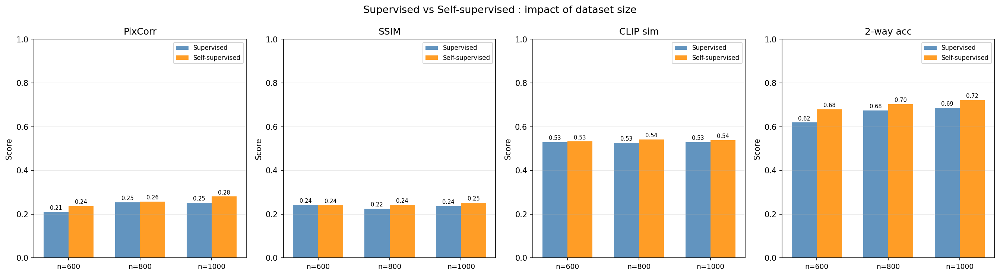

Even if the difference of obtained score isn't always impressive, the models that are trained with self-supervision consistently obtain better results than the models without. This shows that self-supervision is an effective way to compensate for data scarcity (up to a certain point).

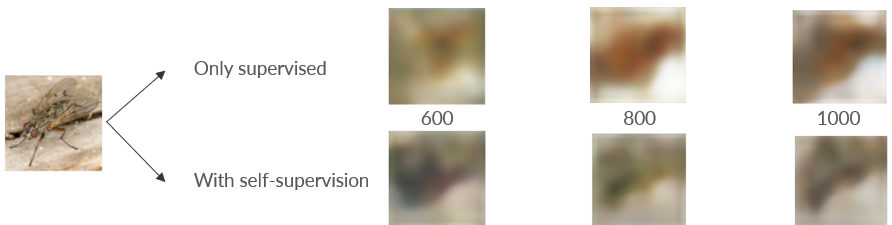

---
## Conclusion of the project:

Even if the pipeline to reconstruct images does not permit to obtain as faithful reconstrcutions as what later models or even Beliy et al. have achieved, it has shown three things:
- Retrieving meaningful spatial and color information from fMRI is possible, even with a simple Encoder-Decoder architecture. 
- Lower parts of the visual cortex are more useful than higher parts (at least with this method).
- Self-supervision improves results when the dataset is too small to effectively cover the scope of natural images.

On a more personal standpoint, this course was a very interesting way to learn about good pratices for reproduceable science and how to use new tools. It allowed me to become more familiar with deep learning and model implementation and training. I found it particularly enjoyable to learn about the brain and how to analyze my results regarding the different parts of the visual cortex.

---
## Setup and usage

```bash
git clone https://github.com/brainhack-school2026/chasteauneuf_project.git
cd chasteaueuf_project
```

### Requirements


```bash
conda create -n fmri_reconstruction python=3.11
conda activate fmri_reconstruction
pip install -r requirements.txt
```
Pytorch may need special care:
```bash
# CPU only
pip install torch torchvision

# GPU CUDA 11.8
pip install torch torchvision --index-url https://download.pytorch.org/whl/cu118

# GPU CUDA 12.1
pip install torch torchvision --index-url https://download.pytorch.org/whl/cu121

```
### Data
1. `Subject1.mat` is downloaded automatically in cell 3 of `fmri_to_image_pipeline.ipynb`
2. Stimulus images: need to be requested  https://forms.gle/ujvA34948Xg49jdn9. Place `images_passwd.zip` at the repo root
3. TinyImageNet is downloaded automatically

### Running

Notebooks are designed to run from the repository root, locally or on Google Colab. All paths are relative. Notebooks can be run independently:

1. `fmri_to_image_pipeline.ipynb` : full pipeline
2. `Experiment_ROI.ipynb` : ROI analysis
3. `experiment_dataset_size.ipynb` : dataset size analysis

### GPU

Training requires a GPU (~30-40 min per model with a GPU T4)

---
## Aknowledgements:

A lot of thanks to Eva Alonso Ortiz and Sebastian Rios for supervising this course at Polytechnique, and to all contributors of Brainhack School.


## References

**Main paper**

Beliy R., Gaziv G., Hoogi A., Strappini F., Golan T., Irani M. (2019). From voxels to pixels and back: Self-supervision in natural-image reconstruction from fMRI. https://arxiv.org/abs/1907.02431

**Dataset**

Horikawa T. & Kamitani Y. (2017). Generic decoding of seen and imagined objects using hierarchical visual features. https://doi.org/10.1038/ncomms15037
